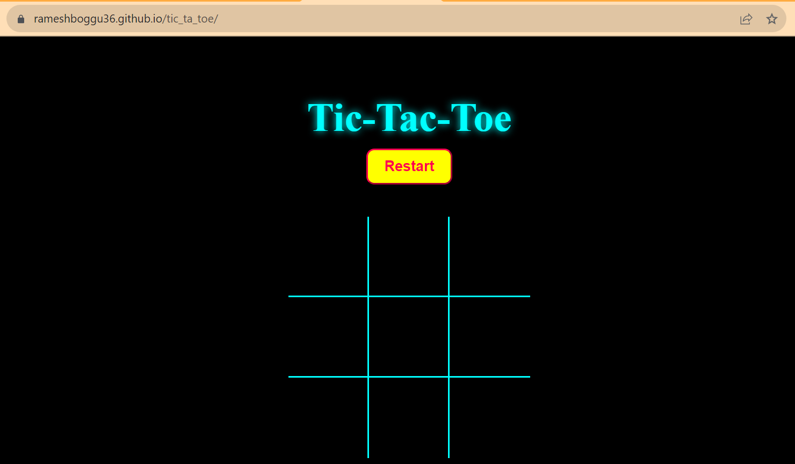
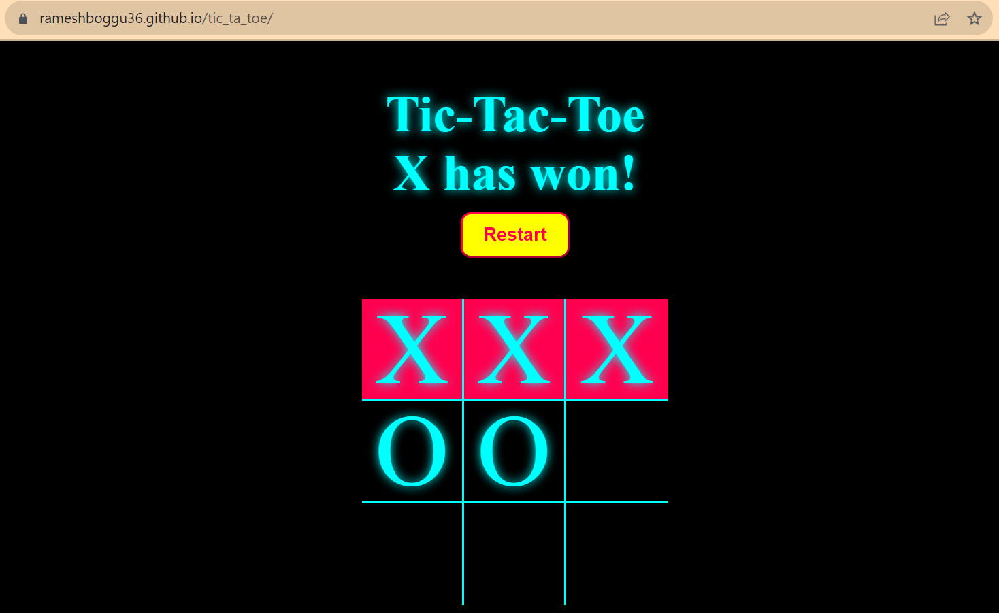
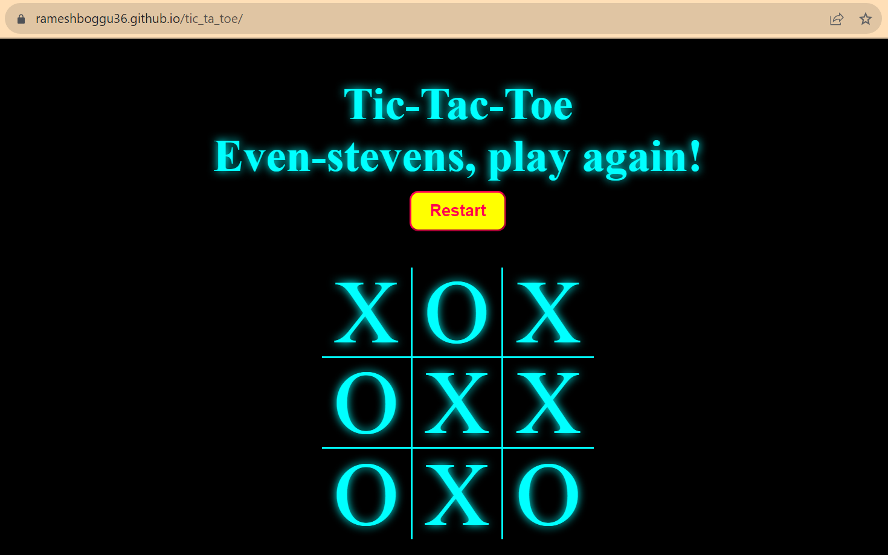

# Tic Tac Toe Game 

Created a Tic Tac Toe game using HTML, CSS and JavaScript.

In this project, to find the winning combination, I have used an array of all the winning combinations and checked, also included a restart button.

You can find web page for tic-tac-toe game here:
[_tic_tac_toe_game_](https://rameshboggu36.github.io/tic_ta_toe/)

Here you can see how the web page of tic tac toe game looks like:

When a Player wins this is how the message is displayed:

When no player wins, this is how the message is displayed:

Along with these, I have added some additional features like:
1. When a player wins, the remaining blocks were disabled to click.

2. When the restart button is clicked, all the cells will be emptied. 

